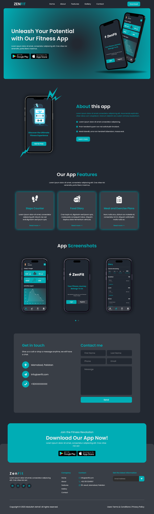
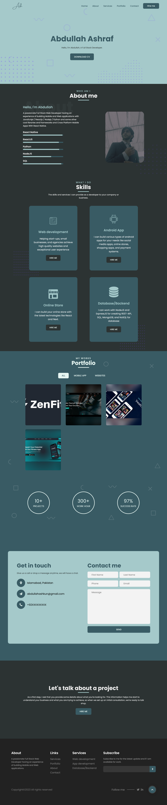
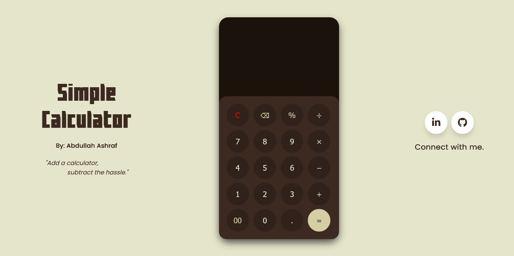

# CodSoft Internship Projects

Welcome to my CodSoft Internship project repository! This repository contains the code and details of the tasks I completed during my internship. Below, you'll find information about each task along with links to demos and screenshots.

## Project Details

### Level 1 Task 1: App Landing Page

- **Description**: I created an App landing page for an app called Zenfit.
- **Technologies Used**: HTML, CSS, JavaScript

**Demo**: [Click Here](https://app-landing-page.abdullahashkun.repl.co/)

**Screenshot**:

  

### Level 1 Task 2: Portfolio

- **Description**: I developed a personal portfolio website.
- **Technologies Used**: HTML, CSS, JavaScript

**Demo**: [Click Here](https://portfolio.abdullahashkun.repl.co/)

**Screenshot**:

  

### Level 1 Task 3: Calculator

- **Description**: I designed a user-friendly calculator.
- **Technologies Used**: HTML, CSS, JavaScript

**Demo**: [Click Here](https://calculator.abdullahashkun.repl.co)

**Screenshot**:

  

## How to Use

To explore each project, follow these steps:

1. Click on the project folder above to access the project of interest.
2. Inside each project folder, you'll find all the materials and the source code.

### *Thank you for checking out my work!* ###

